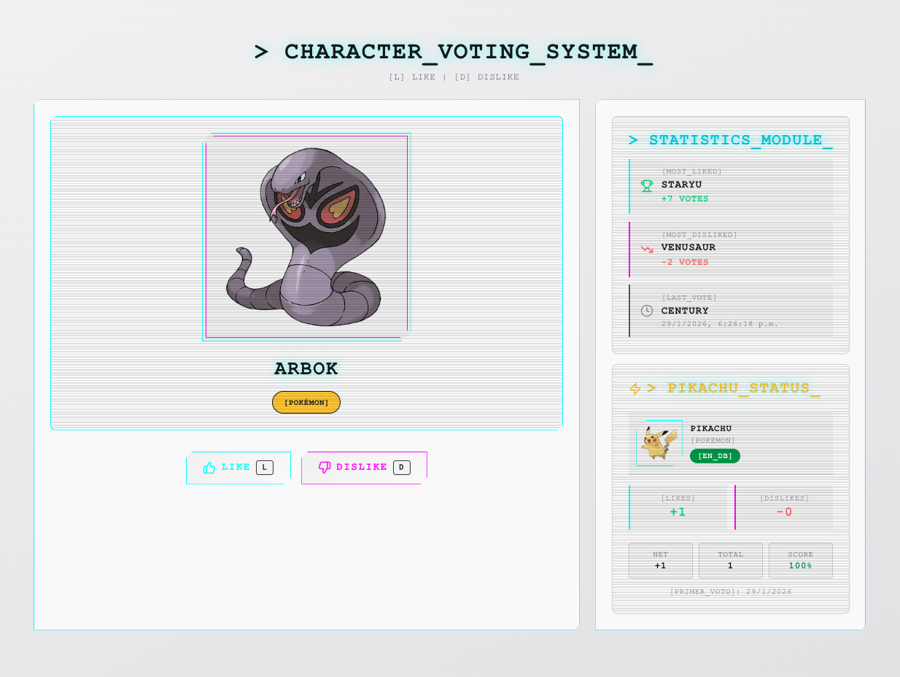

# Like o Dislike - Aplicación de Votación

Vota si te gustan o no los personajes de Rick and Morty, Pokémon, Superhéroes y Star Wars.

## Vista Previa



## Requisitos Previos

Necesitas tener instalado:

- **Node.js** (v20+) - [Descargar aquí](https://nodejs.org/)
- **pnpm** - Instalar con: `npm install -g pnpm`
- **Cuenta de MongoDB Atlas** (gratis) - [Registrarse aquí](https://www.mongodb.com/cloud/atlas)

## Instalación Paso a Paso

### 1. Clonar y descargar dependencias

```bash
# Clonar el repo
git clone <url-del-repo>
cd prueba-tecnica-bx

# Instalar dependencias
pnpm install
```

### 2. Configurar MongoDB Atlas

1. Entra a [MongoDB Atlas](https://www.mongodb.com/cloud/atlas) y crea una cuenta gratis
2. Crea un cluster (selecciona el plan FREE M0)
3. En "Database Access", crea un usuario con password
4. En "Network Access", agrega la IP `0.0.0.0/0` (acceso desde cualquier lugar)
5. En "Connect", copia la connection string

### 3. Configurar variables de entorno

```bash
# Backend
cp apps/backend/.env.example apps/backend/.env
```

Edita `apps/backend/.env`:

```bash
MONGODB_URI=mongodb+srv://<usuario>:<password>@<cluster>.mongodb.net/prueba-tecnica-bx?retryWrites=true&w=majority
SUPERHERO_API_TOKEN=<tu-token>  # Opcional: obtenlo en https://superheroapi.com/
```

```bash
# Frontend
cp apps/frontend/.env.example apps/frontend/.env.local
```

### 4. Ejecutar

```bash
# Desde la raíz del proyecto
pnpm dev
```

- Frontend: <http://localhost:3001>
- Backend: <http://localhost:3000>

## Estructura del Proyecto

```
prueba-tecnica-bx/
├── apps/
│   ├── backend/      # NestJS API
│   └── frontend/     # Next.js App
├── docs/             # Diagramas y documentación técnica
└── README.md
```

## Endpoints de la API

```
GET  /api/characters/random      # Personaje aleatorio
POST /api/votes                  # Registrar voto
GET  /api/statistics/most-liked  # Personaje con más likes
GET  /api/statistics/most-disliked  # Personaje con más dislikes
GET  /api/statistics/last-evaluated  # Último personaje evaluado
GET  /api/statistics/pikachu-status   # Estadísticas de Pikachu
POST /api/sessions               # Crear sesión de votación
GET  /api/health                 # Health check
```

## Tests

```bash
cd apps/backend

# Ejecutar tests
pnpm test

# Ver coverage en navegador
pnpm test:cov:open
```

## Solución de Problemas

**MongoDB no conecta**: Verifica que la connection string tenga el usuario y password correctos, y que el acceso IP esté configurado en Atlas.
**Puerto 3000 ocupado**: Cambia el PORT en `apps/backend/.env`
**Superhéroes no aparecen**: Necesitas un token de <https://superheroapi.com/> (es gratis)

## Features Bonus

- Sesiones de votación con MongoDB (expiran en 1 hora)
- Endpoint especial de Pikachu
- Integración con Star Wars API
- Skeletons de carga
- Tests unitarios con coverage visual
- Seguridad: Helmet, CORS, rate limiting
- Diseño responsive
- Microinteracciones
