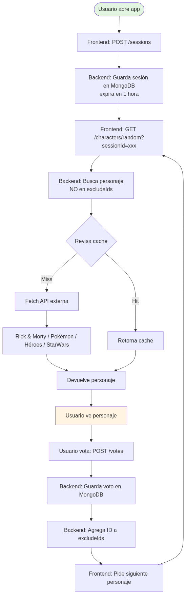
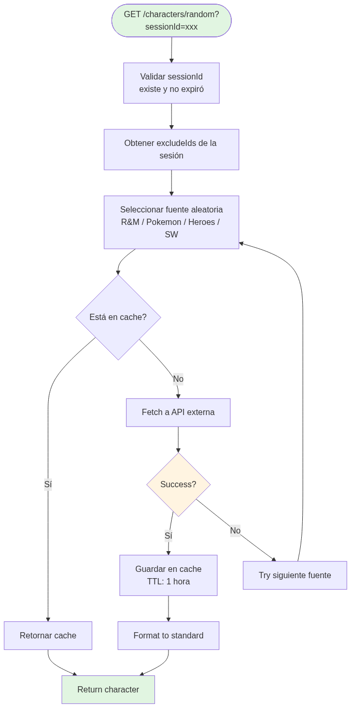
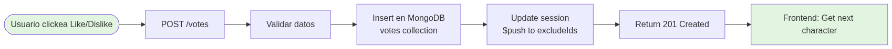
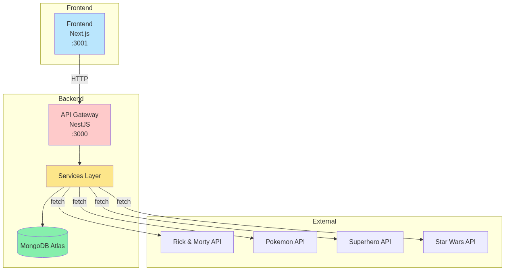
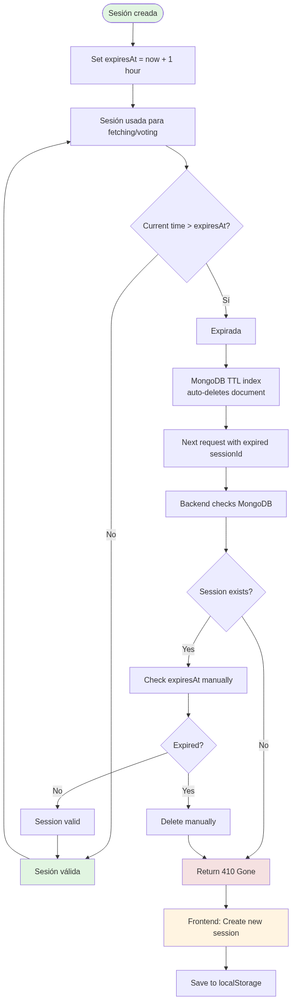

# Diagramas de Flujo

## Flujo Principal de la Aplicación



## Obtener Personaje Aleatorio



## Registrar Voto



## Arquitectura del Sistema



## Expiración de Sesión



## Descripciones Texto

### Flujo Principal

```
Usuario abre app
    │
    ▼
Frontend crea sesión (POST /sessions)
    │
    ▼
Backend guarda sesión en MongoDB (expira en 1 hora)
    │
    ▼
Frontend pide personaje (GET /characters/random?sessionId=xxx)
    │
    ▼
Backend busca personaje que NO esté en excludeIds de la sesión
    │
    ├─► Revisa cache primero
    │
    └─► Si no está, hace fetch a API externa (Rick&Morty / Pokémon / Héroes / StarWars)
    │
    ▼
Devuelve personaje al frontend
    │
    ▼
Usuario ve personaje y vota (POST /votes)
    │
    ▼
Backend guarda voto en MongoDB
    │
    ▼
Backend agrega personajeId a excludeIds de la sesión
    │
    ▼
Frontend pide siguiente personaje
    │
    ▼
(Ciclo se repite)
```

### Registrar Voto

```
Usuario clickea Like/Dislike
    │
    ▼
POST /votes { characterId, vote, sessionId }
    │
    ▼
Validar datos
    │
    ▼
Insertar en MongoDB (votes collection)
    │
    ▼
Actualizar sesión: $push characterId a excludeIds
    │
    ▼
Retornar 201 Created
    │
    ▼
Frontend obtiene siguiente personaje
```

### Estadísticas

```
Most Liked:
  Agregación MongoDB → agrupa por personaje → suma likes → ordena desc → limit 1

Most Disliked:
  Agregación MongoDB → agrupa por personaje → suma dislikes → ordena desc → limit 1

Last Evaluated:
  Find one → sort by createdAt desc → limit 1

Pikachu Status:
  Find by { source: 'pokemon', externalId: '25' }
  Si existe → calcula total, porcentaje, ranking
```

### Expiración de Sesión

```
Sesión creada con expiresAt = ahora + 1 hora
    │
    ▼
MongoDB TTL index elimina automáticamente documentos expirados
    │
    ▼
Si usuario hace request con sesión expirada
    │
    ▼
Backend retorna 410 Gone
    │
    ▼
Frontend crea nueva sesión automáticamente
```
